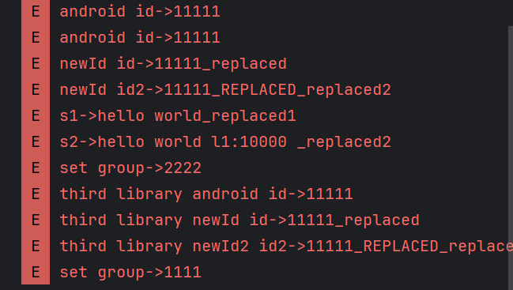

classpath 'com.fxa.transformer.timecost:com.fxa.transformer.timecost.gradle.plugin:1.0.4-SNAPSHOT'
classpath 'com.fxa.transformer.replace:com.fxa.transformer.replace.gradle.plugin:1.0.4-SNAPSHOT'

使用方式:
先把transformer 库发布到本地maven仓库

方法替换插件
id 'com.fxa.transformer.replace' apply true

1.配置替换规则
method_replace_rules.json 位于项目根目录

{
"targetClass": "com/example/asmdemo/TestUtils",
"targetMethod": "getFun",
"targetParameterTypes": ["java/lang/String", "java/lang/String", "java/lang/Long"],
"methodType": "static",
"replacementMethod": "com/chaoxing/transformer/MethodReplaceUtil.fun",
"returnType": "Ljava/lang/String"
}
规则解释
com/example/asmdemo/TestUtils的getFun(String s1,String s2) 替换为com/chaoxing/transformer/MethodReplaceUtil.fun 方法

说明 
1.类路径必须/ 
2.必须指定方法参数类型和返回类型，返回类型目标和被替换的必须一致
3.根据JAVA规范，参数描述符基本类型不需要加L 其他类型需要加L

运行效果

修改字节码,插入耗时统计代码来分析函数耗时
id 'com.fxa.transformer.timecost' apply true
使用方式:
1.本地先找到transformer的gradle 执行publishToMavenLocal任务
2.添加插件的classpath 依赖       
一般是项目根目录的build.gradle
3.在需要使用的模块的build.gradle添加插件和配置
id 'com.fxa.transformer.timecost' apply true

methodTimerConfig {
    classesToTransform = [
      'com.example.asmdemo.MainActivity', 'com.example.asmdemo.TestUtils']
    packagesToTransform= [
     'com.chaoxing.mobile.conferencesw'
    ]
}

classesToTransform 配置的是 指定要修改的具体class 比如我就要只修改课堂页面的Activity
packagesToTransform 配置一个包名，可以是多个,对这些包下的所有class 修改

4.需要在app下创建一个目录为 com.chaoxing.transformer 的工具类
MethodTimerLogUtil

这个工具类的作用就是在修改字节码的时候 最后打印日志时要调用的统一入口
在这里面做一些判断 比如对耗时300ms以上的才打印log 

public class MethodTimerLogUtil {

    private static final String TAG = "MethodTimerLogUtil";

    public static final int SLOW_TIME = 50;

    public static void log(String method,long cost){
        if(cost >= SLOW_TIME){
            Log.d(TAG,"source:"+method+" cost:"+cost+"ms "+ "thread:"+Thread.currentThread().getName());
        }
    }
}

